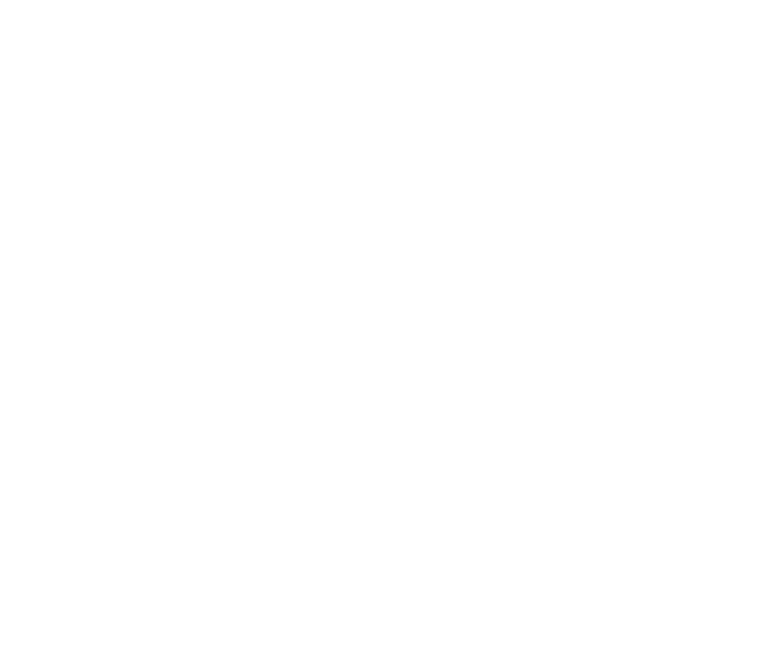

  

## Overview

**msptools** is a collection of utilities and scripts designed to facilitate the analysis and processing of Optical Forces in plasmonic particle systems characterized by the Multiple Scattering Problem (MSP). 

## Features

- 

## Installation

Clone the repository and install dependencies:

To use the code in this repository, follow these steps:

1. Clone the repository: `git clone https://github.com/JJkrokoder/msptools/tree/main#` or `git clone git@github.com:JJkrokoder/msptools.git`
2. Install the required dependencies in a new environment: `conda env create -f environment.yml`
3. Activate the virtual enironment: `conda activate msptools`
4. Install the package in this environment: `pip install .`

## Usage

Basic usage example:

## License

## Documentation

Further documentation can be found in: https://msptools.readthedocs.io/en/latest/#msptools

## Contact

For questions, issues, or discussions, please use the GitHub Issues page.

