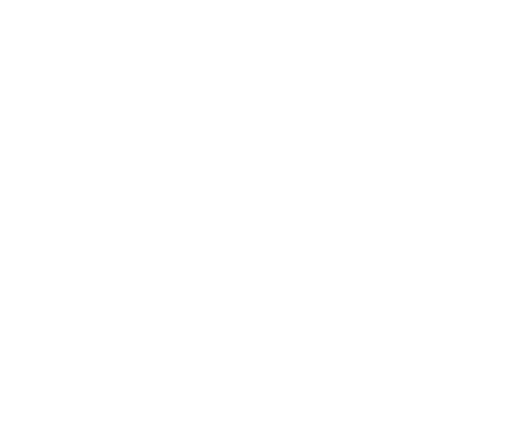

<p align="center">
  
</p>

## Overview

**msptools** is a collection of utilities and scripts designed to facilitate the analysis and processing of Optical Forces in plasmonic particle systems characterized by the Multiple Scattering Problem (MSP). 

## Features

- 

## Installation

To install the package use pip:

```bash
pip install msptools
```

If you want to install the cupy GPU-accelerated version, use:

```bash
pip install msptools[gpu]
```

## Usage

Basic usage example:

## License

This project is liscensed under the MIT License

## Documentation

Further documentation can be found in: https://msptools.readthedocs.io/en/latest/#msptools

## Contact

For questions, issues, or discussions, please use the GitHub Issues page.


